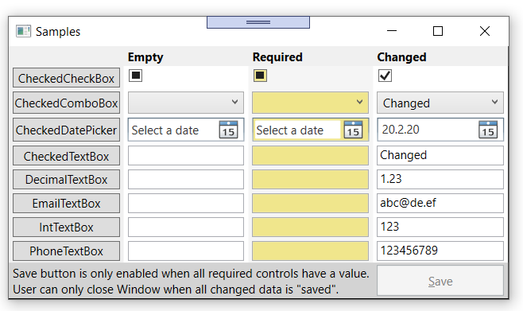

# Base WPF Window functionality for data entry and writing custom controls

## Table of content
[About](#about)  
[Data Entry Samples Application](#data-entry-samples-application)  
&nbsp;&nbsp;[Coding](#coding)  
&nbsp;&nbsp;[Further documentation](#Further-documentation)  
[Build requirements](#build-requirements)  
[Structure WpfWindowsLib Solution](#structure-wpfWindowsLib-solution)  
[Project Status](#Project-Status)  
[Copyright](#Copyright)  

## About

To support data entry on a Window, quite a bit of code is needed 
to decide if any data has been changed, i.e. the save button should be
enabled and to check if all required data is entered. The controls in 
`WpfWindowsLib` detect themselves if there was a change and inform the window
automatically.

A few other methods are in this library, which are helpful when writing
WPF applications, like `GlyphDrawer` which allows to measure text length and
writing text directly to a DrawingContext or `CustomControlBase` which
provides functionality like drawing to the screen or `Border` and `Padding` support to your
custom control.

## Data Entry Samples Application

The project `Samples` shows the various controls available and demonstrates
how the user will interact with them:

 There are 3 columns. The first shows controls with no data, the second controls
with no data, but the user has to fill in some data because they are required for 
saving (note the different background color) and the third column shows controls 
with some initial data.

The Save button gets only enabled once the user has entered some data for 
all required controls. If he tries to close the window before doing so, a warning
message gets displayed. If everything is saved, but 1 control gets changed 
again, the same thing happens. The user needs to save before he can close the
window.

A warning message shows him which data has changed and asks
if he really wants to lose that change by closing or save it by clicking the Save
button.

### Coding

To support automatic detection of changes and autoregistration to the host window, a
control can use `IChecker`, which implements the `ICheck` functionality. It 
can then be placed in a Window inheriting from `CheckedWindow`. The initial value and 
setting `IsRequired` is done from XAML or code behind:

    RequiredDecimalTextBox.Initialise(1.23, isRequired: true);

The controls using `IChecker` will automatically search for the parent
`CheckedWindow`, register with it and inform it if their `HasChanged` or 
`IsAvailable` property (true if the user has entered a value in a required control) 
has changed. `CheckedWindow` checks all other controls 
and calls `OnICheckChanged`or `OnIsAvailableChanged` as needed.

### Further documentation
For a more detailed documentation see:
 [CodeProject: Base WPF Window Functionality for Data Entry](https://www.codeproject.com/Articles/5257393/Base-WPF-Window-Functionality-for-Data-Entry)

## Build requirements
.Net Core 3.1 or later

## Structure WpfWindowsLib Solution
### WpfWindowsLib
The only library needed to be referenced from other code, providing:
* `ICheck`, `IChecker` and various controls
* `CustomControlBase`: Base class for custom controls with functionality added for Children, Drawing, 
`Border`, `Padding` and `Background`.
* `GlyphDrawer`: Writes text to a `DrawingContext`. Can also be used to calculate the length of text.
### Samples
WPF Core application showing all WpfWindowsLib Controls
### WpfWindowsLibTest
WpfWindowsLib unit tests
### CustomControlSample
Shows how to use `CustomControlBase`
### CustomControlSampleLib
Helper library for `CustomControlSample`

## Project Status
* **Data Entry** functionality: Completed and stable
* **Custom Control** functionality: Under construction

## Copyright
Copyright 2020 Jürg Peter Huber, Singapore.

Licensed under the [Creative Commons 0 license](COPYING.txt)

