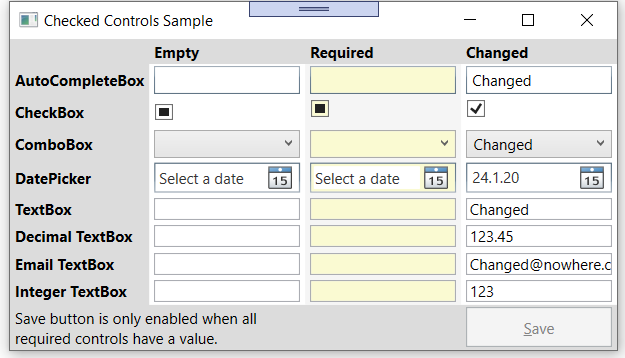
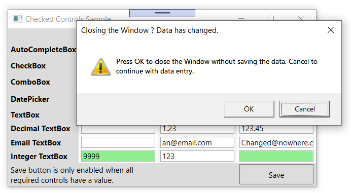

# Base WPF Window functionality for data entry

## About

When the user can enter some data on a Window, quite a bit of code is needed 
to decide if any data has been changed, i.e. the save button should be
enabled and to check if all required data is entered. The controls in this
library detect themselves if there was a change and inform the window
automatically.

A Few other methods are in this library, which are helpful when writing
WPF applications, like `GlyphDrawer` which allows to measure text length and
writing text directly to a DrawingContext.

## Sample Application

The project `SampleApp` shows the various controls available and demonstrates
how the user will interact with them:

 There are 3 columns. The first shows controls with no data, the second controls
with no data, but the user has to fill in some data because they are required for 
saving (note the different background color) and the third column shows control 
with some initial data.

The Save button gets only enabled once the user has entered some data for 
all required controls. If he tries to close the window before doing so, a warning
message gets displayed. If everything is saved, but 1 control gets changed 
again, the same thing happens. The user needs to save before he can close the
window.

Here the user saved successfully the data, then changed 2 integer values and
tried to close the window. An error message shows him which data has changed and 
if he really wants to lose that change by closing or save it by clicking the Save
button.

## Coding

A control has to implement `ICheck` to support automatic detection of changes. It 
can then be placed in a Window inheriting from `CheckedWindow`. The initial value and 
setting `IsRequired` is done from code behind:

    RequiredDecimalTextBox.Init(1.23, isRequired: true);

The controls implementing `ICheck` will automatically search for the parent
`CheckedWindow`, register with it and inform it if their `HasChanged` or 
`IsAvailablev` property has changed. `CheckedWindow` checks all other controls 
and calls `OnICheckChanged`or `OnIsAvailableChanged` as needed.
## Build requirements

.Net Core 3.1 or later

## Copyright

Copyright 2020 Jürg Peter Huber, Singapore.

Licensed under the [Creative Commons 0 license](COPYING.txt)

